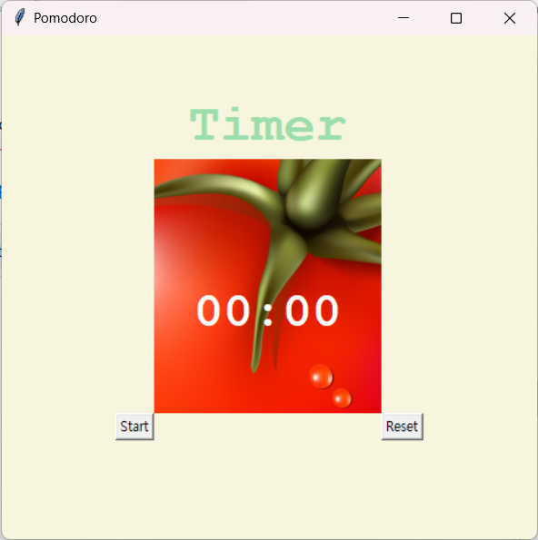

# Pomodoro Timer

This Pomodoro Timer is a simple Python script to help you manage your time using the Pomodoro Technique. The Pomodoro Technique is a time management method that uses a timer to break work into intervals, traditionally 25 minutes in length, separated by short breaks.

## Features

- **Work Sessions**: Set a specific time for work sessions.
- **Short Breaks**: Automatically switch to short breaks after each work session.
- **Long Breaks**: Take a longer break after a set number of work sessions.
- **Visual Cues**: The timer title changes color to indicate whether it's time for work, a short break, or a long break.

## Screenshots

## How to Use

1. Ensure you have Python installed on your computer.
2. If you're using the executable version (`main.exe`), make sure that the `tomato.png` file is always located in the same folder as the `main.exe` file.
3. Simply double-click `main.exe` to run the timer.
4. Follow the on-screen instructions to start, pause, or reset the timer.

## Customize

You can customize the duration of work sessions, short breaks, and long breaks by adjusting the constants `WORK_MIN`, `SHORT_BREAK_MIN`, and `LONG_BREAK_MIN` in the script.

## Contributing

Contributions are welcome! If you have any suggestions, feature requests, or find any issues, please feel free to open an issue or submit a pull request.

